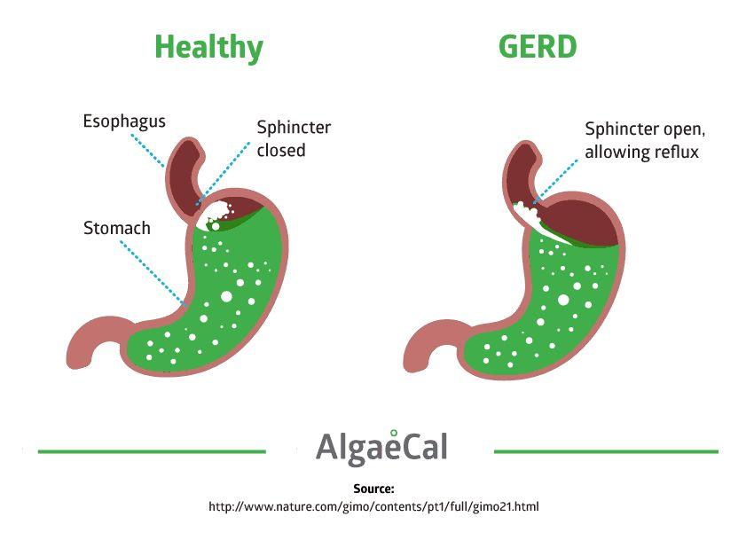
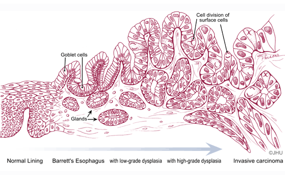
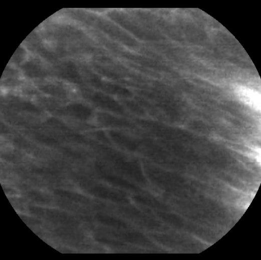

```{r setup, include=FALSE}
library(ggplot2)
library(gridExtra)

knitr::opts_chunk$set(echo = TRUE)
#knitr::opts_knit$set(root.dir = getwd())

load("../data/TrainingSet_20aimVO.rda")
load("../data/test_data_order.rda")

```

## Barrett's Esophagus

```{r image_grobs6, fig.show = "hold", out.width = "100%", fig.align = "default", echo=FALSE}



#knitr::include_graphics("../slideshow/TestSet/p57.gif")

#
#


```

Schema des Krankheitsverlaufs:

```{r image_grobs7, fig.show = "hold", out.width = "100%", fig.align = "default", echo=FALSE}

#



#
#


```


## Input data

We have images from 61 patients.
Each image is a 2D matrix x_i_p where i is an index ranging from 0 to the number of images acquired from partient p.  
patient = p  
i from 0 to n = number of images from patient p

Interesting description from the data description:  
"The rationale for including a patient index is that there might be some level of correlation
between images acquired from one single patient which is larger than from two different
patients."

## Output data

we have four classes:  
0 = “Squamous_Epithelium”   (1469 pictures)  
1 = “Intestinal_metaplasia” (3177 pictures)  
2 = “Gastric_metaplasia”    (1206 pictures)  
3 = “Dysplasia_and_Cancer”  (3594 pictures)  

They guarantee that if an image acquired from a patient is in the training set, there is no image
acquired from the same patient in any test sets.

## Metric

Non weighted Multiclass accuracy =
(Number of images in the test set automatically assigned to the correct class) /
(Number of images in the test set)


## Picture and patient numbers

We just wanted to know how many pictures each patiens has and which picture number occurs most often.

```{r, echo=FALSE}
#getwd()


p <- ggplot(TrainingSet_20aimVO, aes(x=patientNumber))+
     geom_histogram(binwidth = 1)+
     ylab("Number of pictures")+
     xlim(-1,61)+
     ggtitle("Training set")


q <- ggplot(test_data_order, aes(x=patientNumber))+
     geom_histogram(binwidth = 1)+
     ylab("Number of pictures")+
     xlim(-1,61)+
     ggtitle("Test set")

grid.arrange(p, q)
```


```{r, echo=FALSE}
p <- ggplot(TrainingSet_20aimVO, aes(x=imageNumber))+
     geom_histogram(binwidth = 1)+
     ylab("Number of patients")+
     xlim(-1,675)+
     ggtitle("Training set")

q <- ggplot(test_data_order, aes(x=imageNumber))+
     geom_histogram(binwidth = 1)+
     ylab("Number of patients")+
     xlim(-1, 675)+
     ggtitle("Test set")

grid.arrange(p, q)
```

We are also interested if all pictures of a patient have the same label?


```{r, echo=FALSE}


q <- ggplot(TrainingSet_20aimVO, aes(x=classNumber))+
     geom_histogram(binwidth = 1)+
     facet_wrap(~patientNumber)
q

```

Patient number 12, 32 and 51 contain labels 1 and 2.  
Patient number 11 contains labels 0 and 1.  
Patient number 53 contains labels 1 and 3.  
The other 39 patients only have one label assigned.  

## Slideshow training set

### Patient 0, 1, 36 - Class 0

```{r image_grobs, fig.show = "hold", out.width = "30%", fig.align = "default", echo=F}

#
#

# see: https://community.rstudio.com/t/how-to-stack-two-images-horizontally-in-r-markdown/18941


knitr::include_graphics("../slideshow/TrainingSet/p1_c0.gif")

#knitr::include_graphics("../slideshow/TrainingSet/p36_c0.gif")


```


### Patient 30, 7, 35 - Class 1

```{r image_grobs2, fig.show = "hold", out.width = "30%", fig.align = "default", echo=F}

knitr::include_graphics("../slideshow/TrainingSet/p30_c1.gif")

knitr::include_graphics("../slideshow/TrainingSet/p7_c1.gif")

#knitr::include_graphics("../slideshow/TrainingSet/p35_c1.gif")

#

```


### Patient 10, 24 - Class 2

```{r image_grobs3, fig.show = "hold", out.width = "30%", fig.align = "default", echo=F}

knitr::include_graphics("../slideshow/TrainingSet/p10_c2.gif")

knitr::include_graphics("../slideshow/TrainingSet/p24_c2.gif")

#

```


### Patient 44, 3 - Class 3

```{r image_grobs4, fig.show = "hold", out.width = "30%", fig.align = "default", echo=F}

knitr::include_graphics("../slideshow/TrainingSet/p44_c3.gif")

knitr::include_graphics("../slideshow/TrainingSet/p3_c3.gif")

#

```


## Slideshow test set

### Patient 21, 57 - Class ?

```{r image_grobs5, fig.show = "hold", out.width = "30%", fig.align = "default", echo=FALSE}

knitr::include_graphics("../slideshow/TestSet/p21.gif")

knitr::include_graphics("../slideshow/TestSet/p57.gif")

#
#


```


